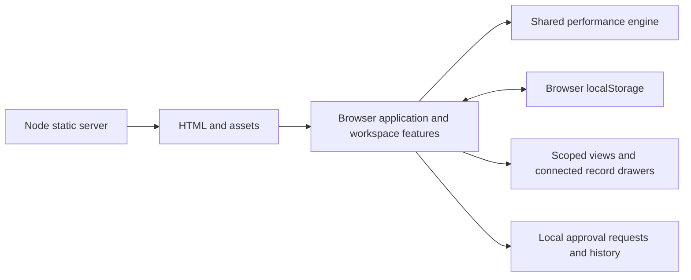

# Architecture

**Reviewed: 17 September 2026.** ITQAN IQ is a browser-rendered JavaScript prototype with a Node.js static server. It has no framework, bundler, application API or database. The [functional specification](FUNCTIONAL_SPECIFICATION.md) describes its business behavior.

## Runtime and file responsibilities

`public/index.html` loads `/data.js`, `/workspace.js` and `/app.js` in that order. These are classic scripts sharing browser globals. The performance engine exposes `Data` in the browser and a CommonJS export for tests; workspace feature functions use the state initialized by the application.

| Location | Responsibility |
| --- | --- |
| `public/index.html` | HTML shell, fonts, scripts and style references |
| `public/assets/` | Shared product mark and UAE PASS artwork |
| `src/app.js` | Synthetic seed records, local state/session, routing, scoped projections, forms, approvals, plan lifecycle, reporting and administration |
| `src/features/workspace.js` | Strategic hierarchy, shared recovery chooser, recovery workflow summary, lookup catalogues, source search and workspace guide |
| `src/domain/performance.js` | KPI validation, historical projection, status, achievement, hierarchical aggregation, trends, breach routing and recovery eligibility |
| `src/styles/main.css` | Shared components, login, responsive layout, RTL and print styling |
| `server/index.cjs` | GET/HEAD handling, public asset allowlist, MIME types and loopback listener |
| `tests/` | Node test runner suites; JSDOM provides the UI test environment |
| `scripts/smoke-test.cjs` | Eleven-view VM smoke check |
| `docs/` | Tracked project Markdown documentation |

## Public URLs and view routes

| Public URL | Repository file |
| --- | --- |
| `/`, `/index.html` | `public/index.html` |
| `/data.js` | `src/domain/performance.js` |
| `/workspace.js` | `src/features/workspace.js` |
| `/app.js` | `src/app.js` |
| `/style.css` | `src/styles/main.css` |
| `/icon.svg` | `public/assets/icon.svg` |
| `/uae-pass.svg` | `public/assets/uae-pass.svg` |

Only these assets are served. Source directories, documentation, package files, tests and server code are not arbitrary public paths. The eleven views use browser hash routes: `#/dashboard`, `#/strategy`, `#/kpi`, `#/data`, `#/ai`, `#/impact`, `#/actions`, `#/reports`, `#/approvals`, `#/admin` and `#/audit`.

Moving source files does not change these public URLs or storage keys. Drawers carry contextual Back navigation separately from main-view browser history.

## Connected information model

| Record | Identity and relationships |
| --- | --- |
| Strategic goal | Stable ID, name, optional Arabic name/description, owner and icon; parent of multiple objectives |
| Objective | Stored in the legacy `goals` array; its index remains the KPI `goal` reference; `strategicGoalId` links the parent; includes name, owner and responsible department |
| KPI | Stable ID, objective index, department, owner, source, optional `sourceKey`, definition/formula, type, direction, unit, actual/target history, draft/publication state and version |
| Plan | ID, type, execution status and approval state; links to a KPI, or directly to an objective and department for simple actions |
| Recovery detail | Immutable creation trigger; cause, corrective steps, success criteria, reviewer, cadence, milestones, reviews and closure evidence |
| Approval request | Entity ID/type, request type, department, requester, before/proposed snapshots, base version, review stage, deadline and decisions |
| Account | ID, role, department and active status; owners on business records remain descriptive text |
| Configuration | Organization labels, policies, defaults, enabled list values, retained KPI types, source profiles and department ownership |
| Audit entry | Event, actor, timestamp and department context where applicable |

Legacy paired goal/objective records migrate into separate strategic parents and objectives without changing objective indexes or KPI/plan references. Goal edits propagate labels to child records. Objective edits retain their index. Deletion and reordering are not provided. Department names and objective indexes need stable database identifiers in a production design.

KPI-linked plans inherit department and objective through the KPI. Direct objective actions store their responsible department, which controls access and approval routing. Closing either plan type does not write KPI observations.

## State, calculation and period ownership

| Storage key | Contents |
| --- | --- |
| `itqan-demo-v1` | Seed marker, KPIs, plans (`actions`), users, approvals, configuration, objectives (`goals`), `strategicGoals`, departments and audit |
| `itqan-user` | Selected simulated account |
| `itqan-auth` | Simulated signed-in state |

The seed marker is `itqan-iq`. Saved workspaces from this seed are preserved and normalized; legacy plans without approval metadata remain drafts. All accounts in one browser origin share that origin's workspace. Other profiles, hosts or ports have separate workspaces; there is no multi-user synchronization.

The reporting calendar is fixed to April–September 2026. Analytical views select a month. Registry changes, plans, recovery and AI guidance resolve to September, the latest sample period. Plan deadlines and review dates use the actual calendar date, independently of that fixed measurement period.

Individual KPI status uses its direction and approved period thresholds. Achievement averages measured KPIs within objectives, measured objectives within strategic goals, and measured strategic goals overall. Missing observations are excluded. Department comparisons use department KPI means. Aggregate Green/Amber boundaries are configurable and also inform objective-based escalation severity.

The domain's `recordActual` function is an internal observation-validation boundary used in tests; no UI control or HTTP ingestion endpoint exposes it. Source labels, mapping keys and configured refresh expectations describe intended attribution only.

## Workflow boundaries

KPI registration and action creation save drafts for later submission. Recovery's primary action validates the initial plan and creates one plan plus one Department-review request; its separate Save draft action creates no request. All recovery entry points resolve an eligible KPI before opening the same `actionForm` implementation.

Governed changes retain the approved entity while a proposed snapshot is reviewed. Department approval starts Strategy review; final approval revalidates and applies the change. Pending requests lock conflicting edits. Local version checks reject stale approvals. Routine progress/evidence and monitoring are audited; structural plan changes become amendment requests.

Recovery effectiveness is tied to the plan revision, current observations/thresholds, configured Green-period window and a future review date. Final closure rechecks the gates and stores evidence. Later changes retain that closure snapshot.

## Production boundary

The static server does not authenticate accounts or enforce departmental access. UI guards demonstrate intended permissions, but every local record can be inspected or edited through the browser. Credential/UAE PASS controls are connection previews, Ask IQ uses local rules, and notifications are computed in-app.

Production requires verified identity, scoped APIs, transactional approvals, durable storage/audit and source ingestion. See [Integrations](INTEGRATIONS.md) for the proposed contracts and [Development](DEVELOPMENT.md) for checks and change placement.
