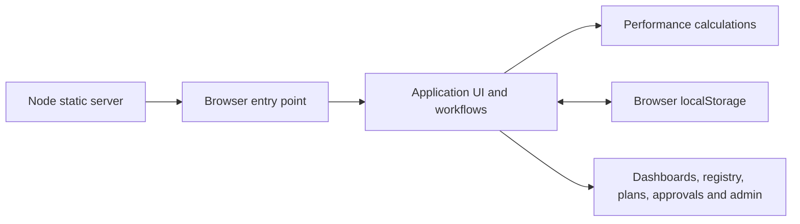

# Architecture

## Runtime

The application is a browser-rendered JavaScript prototype served by a small Node.js HTTP server. It has no framework, bundler, database or application API. `public/index.html` loads the performance engine and workspace feature functions before the application script; the engine exposes `Data` in the browser and a CommonJS export for tests.

## Directory responsibilities

| Location | Responsibility |
| --- | --- |
| `public/` | HTML shell and product assets |
| `src/app.js` | Synthetic seed records, session simulation, hash routes, scoped projections, forms, approval lifecycle, views and administration |
| `src/features/workspace.js` | Goal/objective hierarchy, shared recovery chooser, lookup catalogues, workspace search and help |
| `src/domain/performance.js` | Scoring, RAG status, historical projections, weights, trends, escalation, recovery eligibility and definition/target validation |
| `src/styles/main.css` | Shared visual styling, layouts, mobile rules, RTL and print behavior |
| `server/index.cjs` | GET/HEAD handling, MIME types, explicit public asset allowlist and local listener |
| `tests/` | Node test runner suites; JSDOM supplies browser behavior for UI tests |
| `scripts/` | Standalone development verification scripts |
| `docs/` | Maintained project documentation |

The application uses classic browser scripts: `workspace.js` supplies feature functions, and `app.js` owns shared state, existing views and approval handling. The folder structure separates application, domain, presentation, serving, tests and documentation without introducing a build tool. Future feature modules should preserve the same calculation engine and approval guards.

## Public routes and filesystem mapping

The server maps stable browser URLs to reorganized files. Moving source files does not change bookmarked application routes or browser storage keys.

| URL | File |
| --- | --- |
| `/`, `/index.html` | `public/index.html` |
| `/workspace.js` | `src/features/workspace.js` |
| `/app.js` | `src/app.js` |
| `/data.js` | `src/features/workspace.js` | Goal/objective hierarchy, shared recovery chooser, lookup catalogues, workspace search and help |
| `src/domain/performance.js` |
| `/style.css` | `src/styles/main.css` |
| `/icon.svg` | `public/assets/icon.svg` |
| `/uae-pass.svg` | `public/assets/uae-pass.svg` |

Only these routes are served. Documentation, package files, server code and tests are not public assets. `#/dashboard`, `#/kpi`, `#/actions` and the other view routes are handled in the browser. There is no arbitrary directory listing or filesystem route resolution.

## Connected records

| Record | Key relationships and state |
| --- | --- |
| Strategic goal | Stable parent ID, name, Arabic name, owner and description; contains multiple objectives |
| Objective | Legacy `goals` array stores objectives; index remains the KPI `goal` reference, with `strategicGoalId` linking the parent and a responsible department |
| KPI | Stable `id`, goal reference, department, owner, source, direction, thresholds, observation history and draft/publication state |
| Plan | Stable `id`, plan type, KPI ID or direct objective/department link, owner, deadline and approval state; actions have delivery notes/checklists, recovery has trigger snapshot, corrective detail, milestones and monitoring |
| Approval request | Entity type/ID, before/proposed snapshots, record version, requester, department, review stage, deadline and decisions |
| Account | ID, role, department and active status |
| Configuration | Organization labels, scoring policy, deadlines, plan defaults, notification preferences and source catalogue settings |
| Audit entry | Event, actor, department context and timestamp |

Legacy goal/objective pairs migrate to separate parent goals and objectives. Objective edits preserve the existing index, keeping KPI and plan links intact. The interface does not delete or reorder goals. KPI-linked plan departments are resolved through the KPI. Direct objective actions store a responsible department and objective reference; plan access and approval routing use this assigned department. KPI actuals and historical thresholds are separate from plan progress; closing a plan never writes an actual.

## State and calculations

- `itqan-demo-v1` stores the stamped workspace: KPIs, plans, users, approvals, objectives (`goals`), strategic goals, departments, configuration and audit entries.
- `itqan-auth` and `itqan-user` select the simulated signed-in account.
- The performance engine projects records for a selected month. The sample reporting calendar is April–September 2026.
- Aggregate labels use configured Green/Amber boundaries. Individual KPI status uses its direction and approved thresholds.
- Overall scores use equal strategic-goal weights, equal measured-objective weights inside each goal, and equal KPI weights inside each objective. Missing observations are excluded from achievement.
- Approved closure snapshots retain evidence even when later results, plans or policy change.

## Production boundary

The server only serves files. It does not authenticate users or enforce department access. UI guards demonstrate desired behavior, but all local records are inspectable in the browser. Production needs authenticated APIs, transactional approval handling, durable storage and source ingestion as described in [Integrations](INTEGRATIONS.md).
