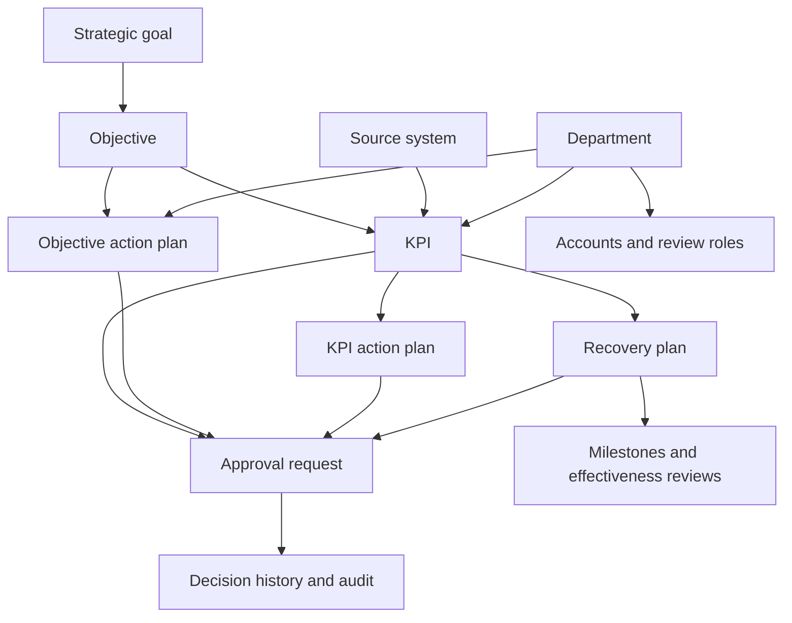

# Object relationships and data consistency

The workspace uses the following relationships. Administration → General includes a live consistency report for the locally loaded workspace.

## Reference rules

| Object | Reference and ownership |
| --- | --- |
| Strategic goal | Stable `id`; objectives refer to `strategicGoalId`. Parent labels are synchronized on load and when edited. |
| Objective | Stable position in the append-only `goals` collection. KPIs use `goal`; direct action plans also use `goal`. A responsible department is recorded separately from departments contributing KPIs. |
| KPI | Stable string `id`, parent objective, responsible `dept`, and source catalogue name. Source metric keys are optional. Source names entered with different letter casing resolve to the existing catalogue entry. |
| Objective action plan | Refers directly to an objective and responsible department. Completion measures task delivery. |
| KPI action or recovery plan | Refers to the KPI by `kpi`. Its current objective and department are resolved through that KPI using `planGoal` and `planDepartment`. |
| Recovery trigger | Snapshot of the initiating period, actual, target, amber boundary, unit, status and source. Subsequent target changes must not rewrite it. |
| Approval | Refers to `entity` + `entityId`, with requesting account, department, base version, before/proposed snapshots and decisions. One pending request per entity. Approval rejects changed record versions or changed department routing. |
| Account | Stable account ID, role, active status and department for department roles. Business owner names are descriptive labels, not account foreign keys. |
| Source | Catalogue name shared by configuration, KPI registration, search and Data flows. Sources with no published measurements remain discoverable for globally authorized users. Catalogue ownership does not imply a live integration. |

Do not reorder or remove entries in the objective array: existing KPI and plan references use its indices. A future database migration should introduce objective IDs with an explicit reference migration.

## Measurement and lifecycle rules

- Observations come from period history. Missing observations and unknown new-KPI baselines are `null`, not zero.
- Targets may have period history. Current values must match the latest historical target entry. Historical targets and actuals are preserved when targets are approved.
- KPI status uses that KPI's target, amber boundary and direction. Aggregate status uses the configured aggregate boundaries, so aggregate achievement and the number of green KPIs measure different things.
- Achievement averages KPIs within each objective, objectives within each strategic goal, and strategic goals overall. Missing observations are excluded from averages and included in attention counts.
- Plans start as drafts in Open. Execution needs approval; recovery also needs a published KPI, corrective details, valid milestone dates and evidence. Overdue is a date-derived condition, not a separate execution state.
- Action completion does not change KPI actuals. Recovery closure additionally requires the configured consecutive green periods and a current effective review.
- New audit events store ISO timestamps; legacy display timestamps remain readable.

## Reviewed sample data

September 2026: 4 strategic goals, 4 objectives, 4 departments, 8 published KPIs, 7 source systems and 3 recovery drafts. KPI status totals: 4 green, 3 amber, 1 red, no missing values. Equal-weight achievement: 95.80913714560207% (96% in rounded display).

Default metadata supplies the sample departments and source teams, and captures the sample recovery triggers. All records remain synthetic. Missing objective departments are inferred only when all linked KPIs identify one department. Ambiguous references are reported for review rather than reassigned or deleted. Metadata completion preserves saved measurements, user edits, decision history and existing trigger snapshots; changes persist with the next normal workspace save.

## Verification

`npm test` exercises calculations, all eleven views, department boundaries, approval stages and plan lifecycles. `tests/integrity.test.cjs` additionally checks graph consistency, seed reconciliation, reload preservation, source visibility, invalid references, invalid dates, changed approval routing and unknown baselines. `workspaceIntegrity()` reports issues in the loaded local data; it does not establish production database integrity or live source connectivity.
