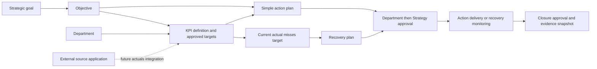
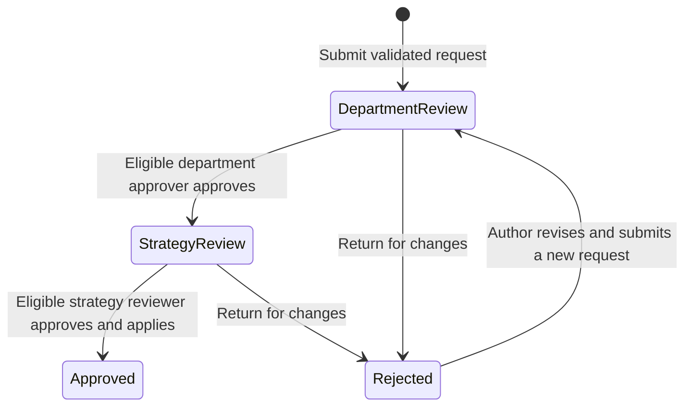
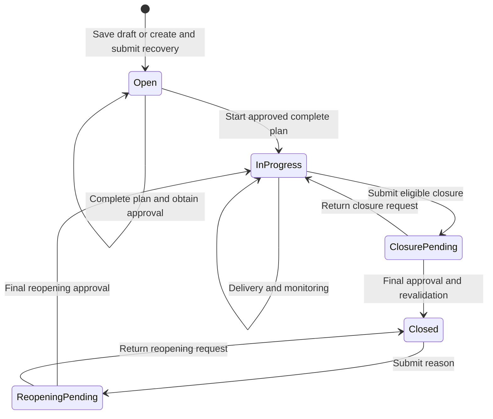

# ITQAN IQ — Detailed Functional Specification

| Document attribute | Value |
| --- | --- |
| Version | 1.1 |
| Last reviewed | 17 September 2026 |
| Product | ITQAN IQ |
| Baseline | UAE login, separate strategic hierarchy, shared recovery creation with immediate approval submission, scoped workspace search and ten-section Administration |
| Status | Draft for business review; describes the implemented prototype and separately identifies production requirements |
| Audience | Business owners, Strategy Team, department representatives, product owners, designers, developers and testers |
| Source of truth | Current application source and existing automated tests, supported by project documentation |

## Contents

1. [Purpose and business scope](#1-purpose-and-business-scope)
2. [Terminology and operating model](#2-terminology-and-operating-model)
3. [Roles, permissions and departmental scope](#3-roles-permissions-and-departmental-scope)
4. [Navigation and shared interaction requirements](#4-navigation-and-shared-interaction-requirements)
5. [Functional screen specifications](#5-functional-screen-specifications)
6. [KPI registration, definition and target setup](#6-kpi-registration-definition-and-target-setup)
7. [Approval management](#7-approval-management)
8. [Action plans and recovery plans](#8-action-plans-and-recovery-plans)
9. [Monitoring, effectiveness and closure](#9-monitoring-effectiveness-and-closure)
10. [Performance calculations and escalation](#10-performance-calculations-and-escalation)
11. [Administration and application configuration](#11-administration-and-application-configuration)
12. [Actuals, source systems and integration requirements](#12-actuals-source-systems-and-integration-requirements)
13. [Reporting, notifications and audit](#13-reporting-notifications-and-audit)
14. [Logical information model and persistence](#14-logical-information-model-and-persistence)
15. [Validation and exception behavior](#15-validation-and-exception-behavior)
16. [Acceptance scenarios and verification](#16-acceptance-scenarios-and-verification)
17. [Production requirements, limitations and open decisions](#17-production-requirements-limitations-and-open-decisions)
18. [Implementation traceability](#18-implementation-traceability)

## 1. Purpose and business scope

### 1.1 Purpose

ITQAN IQ provides a connected workspace for translating strategy into measurable targets and accountable corrective work. A user must be able to understand which objective a KPI supports, what its approved target is, how it is performing, which actions respond to a gap, who owns those actions and whether recovery has been verified.

The application is used to register KPI definitions, set targets, review externally owned results, manage action/recovery plans, monitor delivery and obtain business approvals. Users do not manually enter KPI actuals or baseline observations. Recording plan progress and monitoring evidence is distinct from recording an actual measurement.

### 1.2 Business outcomes

| ID | Outcome |
| --- | --- |
| BO-01 | Make the relationship between strategic objectives, KPIs and corrective plans visible and navigable. |
| BO-02 | Give departmental users access to their department's work while allowing Strategy Team analysis across departments. |
| BO-03 | Apply Department review followed by Strategy review before governed business changes take effect. |
| BO-04 | Maintain targets independently of externally supplied performance results. |
| BO-05 | Require owned tasks and delivery evidence; recovery closure also requires current effectiveness monitoring. |
| BO-06 | Centralize organization, people, framework, performance, approval, recovery and notification configuration. |
| BO-07 | Offer a simple workspace guide that directs users to the relevant screen or record. |

### 1.3 Status convention

Requirements without another status describe **implemented prototype behavior**. They are testable locally but do not imply a production backend or a security guarantee.

- **Implemented:** available in the current UI and/or its local business logic.
- **Production requirement:** needed for operational deployment; not currently implemented.
- **Open decision:** requires business or technical agreement before implementation.

### 1.4 Current scope

The prototype contains eleven main views, ten administration sections, four fixed role types, a shared approval workflow, browser-local persistence, CSV export, browser printing, English/Arabic navigation and rule-based guidance. The initial workspace has four strategic goals, four child objectives, four departments, eight KPIs and three seeded recovery plans. Reporting examples cover April–September 2026; September is the current measurement period.

New strategic goals, objectives, departments, accounts, source catalogue entries, KPI types, KPIs and plans can be added through the implemented forms. The measurement calendar is fixed in the prototype; adding a new reporting year or changing measurement cadence is not an implemented administrator capability. Plan deadlines and monitoring dates use the real calendar independently of the fixed measurement period.

### 1.5 Exclusions from implemented scope

Live SSO, server-enforced permissions, a shared database, real source-system ingestion, scheduled imports, email/SMS delivery, trained or connected AI, document attachment storage, tamper-evident audit retention and configurable workflow design are not implemented. The functional requirements for relevant production extensions are identified in Sections 12 and 17.

## 2. Terminology and operating model

| Term | Meaning |
| --- | --- |
| Strategic goal | High-level strategic outcome with its own identity, owner and optional description; may contain multiple objectives. |
| Objective | Child of one strategic goal, with an owner and responsible department; supports KPIs and direct action plans. |
| KPI | Defined measure with a department, owner, source, unit, direction and approved thresholds. |
| Target | The approved threshold at which an individual KPI becomes Green. |
| Amber boundary | Threshold separating At risk from Off track for an individual KPI. |
| Actual | Observation owned by an external source application; read-only in this product. |
| Achievement | Normalized KPI performance expressed as a percentage and capped at 100%. |
| Action plan | Simple objective/KPI task completed against delivery evidence; a checklist is optional. |
| Recovery plan | Corrective plan that also requires sustained Green KPI results before closure. |
| Corrective plan detail | Root cause, corrective steps, recurrence prevention, success criteria and monitoring schedule within recovery plans. |
| Monitoring review | Recorded assessment of delivery/effectiveness with evidence, blockers, next review and a result snapshot. |
| Approval request | Before/proposed change record that passes Department and Strategy review. |
| Plan execution status | Open, In progress or Closed; separate from the approval status. |
| Returned request | A request with stored status Rejected, presented through “Return for changes” and “Revise and resubmit” actions. |
| Source catalogue | Ownership and expected-refresh configuration; not an established data connection. |

### 2.1 Relationship model

**REL-01:** Each KPI references one objective and one department. Each objective references one strategic goal and has a responsible department. Multiple KPIs may support the same objective.

**REL-02:** An action references either one objective and responsible department, or one published KPI. A recovery plan references one published KPI. KPI-linked plans inherit its department and strategic context. Multiple plans may reference the same KPI.

**REL-03:** Strategic goal and objective records are separate. Editing their labels or owners preserves their identity and existing KPI references. Deletion and reordering are not provided.

**REL-04:** Plan completion does not change actuals or increase the KPI score. The KPI score changes through observations or approved target changes.

**REL-05:** An action may support a healthy published KPI or an objective with no KPI. A new recovery plan requires a current At risk or Off track KPI result; missing data is not a performance breach.

## 3. Roles, permissions and departmental scope

### 3.1 Permission matrix

“Own department” means the account's assigned department. Business-write permissions are based on role and scope, not on matching a free-text record-owner name.

| Capability | Department Contributor | Department Approver | Strategy Team | Administrator |
| --- | --- | --- | --- | --- |
| View departmental KPI data and plans | Own department | Own department | All departments | All departments |
| Create/edit strategic goals and objectives | No | No | Yes, from Strategy & objectives | Yes, from Strategy & objectives or Administration |
| Register KPI and save draft | Own department | Own department | Any department | No |
| Propose target/definition changes | Own department | Own department | Any department | No |
| Create or amend plans | Own department | Own department | Any department | No |
| Record approved-plan progress/reviews | Own department | Own department | Any department | No |
| Submit closure/reopening | Own department | Own department | Any department | No |
| Department-stage approval | No | Own department; not own request | No | No |
| Strategy-stage approval | No | No | All departments; not own request | No |
| Configure application policy, lists and accounts | No | No | No | Yes |
| View/export published performance | Own department | Own department | All permitted departments | All permitted departments |
| View audit and requests | Scoped records | Scoped records | All records | All records |

### 3.2 Access requirements

| ID | Requirement |
| --- | --- |
| ACC-01 | An inactive account is unavailable for sign-in. An invalid/inactive selected session returns to sign-in. |
| ACC-02 | Department roles are constrained to their assigned department in KPI/plan views, direct record access, source data, search, exports and requests. |
| ACC-03 | Strategy and Administrator roles can inspect data across departments. Analytical department selection is a display filter, not a change to authorization. |
| ACC-04 | The Administration navigation entry and shortcut are shown only to administrators. Direct access by another role displays an access explanation. |
| ACC-05 | Administrator status does not grant business-approval or business-record mutation privileges. |
| ACC-06 | A requester cannot approve their own submission at either stage. |
| ACC-07 | Approval eligibility follows the active role and request department, not a separately assigned named reviewer. |
| ACC-08 | Free-text KPI owner, plan owner and review owner describe accountability; they are not independently authenticated principals. |

### 3.3 Sign-in and sign-out

The login screen presents an always-visible “Choose your role” panel alongside organization sign-in. Four role cards offer Strategy Team, Department Contributor, Department Approver and Administrator. Role responsibility is explained on selection. Departmental roles show a department selector; active accounts are filtered to the chosen role and department. A scope summary confirms the access before entry. The organization sign-in area presents UAE PASS before Login ID and Password, with password visibility, Forgot password and Account help. English/Arabic can be selected before entry. On mobile, role selection appears first and sign-in follows below.

**AUTH-01:** Login ID and Password are required in the credential form. Login ID permits up to 140 characters; Password permits up to 256. The password is concealed initially and the visibility button reflects its current state.

**AUTH-02:** Organization sign-in and UAE PASS are not connected in the current prototype. A valid credential-form submission clears the password and explains the unavailable connection. It does not store/transmit credentials or establish a session. UAE PASS shows an explanatory message without redirecting or creating a session. Password recovery does not send a reset request.

**AUTH-03:** Demo access requires no credentials. Entering the selected demo workspace clears previous account-specific filters. Administrators land in Administration. Other roles use the configured default landing page and language. Sign-out returns to the sign-in page without deleting workspace records.

**AUTH-04:** The layout provides a desktop product-introduction panel and a compact mobile sign-in form, with Arabic/RTL support. Keep the provider options and demo access visibly distinct so entering a demo role is not presented as successful identity verification.

**AUTH-05:** Role selection must remain visible without expanding another control. Show all four supported roles with scope descriptions. Filter active demo accounts by selected role and, where applicable, department. Disable entry and explain when no matching account exists. Reject an account that does not match the selection at submission. Preserve role/department/account selections when switching login language. Preview selections must not modify the session until valid demo entry.

**AUTH-06:** Present the ITQAN IQ punch line **Intelligence in Performance.** as a prominent headline above role selection, with **Clarity. Confidence. Impact.** as supporting copy. Use the UAE flag's red hoist and green/white/black bands, flag-color accents and green/white controls. Preserve the flag's physical orientation in Arabic/RTL. Keep role selection, credential sign-in and UAE PASS available at desktop and mobile widths. Brand styling does not imply a live identity connection.

**Production requirement:** Replace profile selection with verified identity and derive roles/departments from trusted claims or server-managed assignments. All authorization must be repeated by the backend; filtering browser data is not departmental data isolation.

## 4. Navigation and shared interaction requirements

### 4.1 Main navigation

| View | Route | Reporting-period selector | Primary purpose |
| --- | --- | --- | --- |
| Executive overview | `#/dashboard` | Yes | Current/historical performance overview |
| Strategy & objectives | `#/strategy` | Yes | Explore goals, objectives, measures and linked plans |
| KPI registry | `#/kpi` | No | Register KPI, inspect definitions and propose current targets |
| Data flows | `#/data` | Yes | Read source-attributed observations |
| Ask IQ | `#/ai` | No | Find records and navigate to useful work |
| Impact & escalation | `#/impact` | Yes | Understand breaches and escalation routes |
| Plans & recovery | `#/actions` | No | Current delivery, approvals, monitoring and recovery |
| Reports & analytics | `#/reports` | Yes | Print, export and compare |
| Approvals | `#/approvals` | No | Review and decide pending changes |
| Administration | `#/admin` | No | Manage application configuration |
| Audit trail | `#/audit` | No | Inspect activity history |

**NAV-01:** Use “Register KPI” consistently for the KPI registration entry point. The global Create menu may retain its generic name because it also offers action and recovery plans.

**NAV-02:** The Create menu offers Register KPI, Create action plan and Create recovery plan for business-writing roles. Recovery opens a current eligible-KPI chooser; selecting the KPI opens exactly the same form as contextual Impact/KPI creation. Plans & recovery provides the same chooser.

**NAV-03:** KPI details offer contextual plan creation. The linked KPI is preselected and its objective path is visible.

**NAV-04:** Objective details link to their KPI registry and plan board. KPI details link to objectives and related plans. KPI-linked plans link back to their KPI and objective; direct objective actions link back to the objective.

**NAV-05:** Detail drawers support Close, Escape and contextual Back navigation. Browser Back/Forward handles main view routes. Closing a drawer returns focus to its opener when available.

**NAV-06:** Analytical reporting-period selection is retained between analytical views. Operational screens resolve to the latest period so a historical selection cannot cause historical target editing or monitoring.

**NAV-07:** Search and filter results show meaningful empty states. A missing result must not fabricate a record or performance value.

**NAV-08:** English/Arabic language switching changes document direction and translated interface strings. Some detailed administration/approval copy remains English; complete localization is a production gap.

### 4.2 Intended short user paths

| User task | Path |
| --- | --- |
| Register measure | Create → Register KPI → definition/targets → Save draft → KPI details → Submit |
| Change target | KPI registry → KPI details → Target setup → Submit change |
| Create action | Objective or KPI details → Create action plan → task, owner, deadline, outcome → Save draft → Submit |
| Create recovery | Current underperforming KPI → Create recovery plan → review gap, cause and steps → Create & submit for approval → Department review → Strategy review → Manage plan |
| Decide request | Approvals → My review → Review request → decision note → Approve / Return for changes |
| Monitor recovery | Plans & recovery → Manage plan → Start recovery after approval → Monitoring & effectiveness → Record review |
| Save unfinished recovery | Same recovery form → Save draft → Manage plan → complete detail/milestones → Submit plan for approval |
| Close plan | Plan detail → verify evidence/criteria → request closure → Department and Strategy decisions |
| Configure app | Sign in as Workspace administrator → Administration → relevant section → Save |

## 5. Functional screen specifications

### 5.1 Executive overview

**OVR-01:** Show goal count, published KPI count, Green KPI count and attention-required count for the authorized reporting scope. Drafts do not contribute to published performance.

**OVR-02:** Show overall achievement, performance change relative to the available reporting trajectory, goal scores and a monthly chart. Display the configured aggregate Green boundary as the chart ambition/reference.

**OVR-03:** List priority measures with actual, target, achievement, status, trend, owner and related objective/plans. Measures with no data remain visible as needing attention.

**OVR-04:** Provide links to strategy, individual KPIs, insights and report export. Generated advisory cards explain observed breaches, data gaps or positive performance using local data.

### 5.2 Strategy & objectives

**STR-01:** Display separate strategic goal cards with accountable owner, aggregate achievement and child objectives. Strategy Team and Administrator can create/edit goals and create/edit objectives under a selected goal. Each objective has its own owner and responsible department. Goal creation offers Create objective as the next step.

**STR-02:** An objective drawer displays its KPI count, active linked plan count and current underperforming KPIs without an active recovery plan.

**STR-03:** Objective measures display actual/target, status and equal KPI weight. Plan links remain navigable from the relevant measure.

**STR-04:** Goals without measurable published KPIs display No data rather than zero achievement. Department views show relevant connected data; adding an objective does not create artificial KPI results.

**STR-05:** An objective can register a KPI with the objective preselected, or create a direct action plan. Preserve existing KPI/plan references through migration from legacy paired records. Allow multiple objectives under one goal; an empty goal is valid during setup.

**STR-06:** Reject duplicate strategic goal names case-insensitively and duplicate objective names within the same parent. Hierarchy changes save directly with audit history for Strategy Team or Administrator; they do not enter the KPI/plan approval flow. Department users see objectives assigned to their department or connected to their permitted KPIs/plans. Moving an objective to another parent preserves its KPI/plan references and changes its strategic roll-up.

| Hierarchy field | Required | Current form constraint |
| --- | --- | --- |
| Strategic goal name and owner | Yes | Up to 240 characters each |
| Arabic goal name and description | No | Up to 240 characters each |
| Objective parent | Yes | Existing strategic goal |
| Objective name | Yes | Up to 160 characters |
| Objective owner | Yes | Up to 100 characters |
| Responsible department | Yes | Existing department directory entry |

### 5.3 KPI registry and details

**REG-01:** Filter by authorized department, objective and status, including Draft. Search by English/Arabic name, ID or owner.

**REG-02:** Rows show KPI/owner, objective/recovery links, actual/target, achievement, status and trend. Selecting a row opens KPI details.

**REG-03:** KPI details expose strategic context, definition, source attribution, historical performance, current thresholds, linked plans and applicable approval state/actions.

**REG-04:** Drafts display no actual/achievement and offer submission when permitted. Pending requests prevent conflicting governed edits.

Detailed registration and target rules appear in Section 6.

### 5.4 Data flows

**DAT-01:** Group published, scoped KPIs by source application for the selected period.

**DAT-02:** Display mapped KPI IDs and source metric/field keys, actuals, confidence flags, source owner and expected refresh cadence. Source-search results open a filtered source view with the same filtered incoming-results table.

**DAT-03:** Clearly identify synthetic observations and unconfigured live connections. Saving source settings must not imply successful synchronization.

**DAT-04:** Provide read-only KPI links and incoming-results tables. Do not provide a Record actual or Edit actual form.

**DAT-05:** KPI details and source search results can open Data flows with a source filter. The filter applies to both source cards and incoming rows; Show all sources clears it. If a source metric key is absent, display the KPI ID as the mapping fallback. A configured source with no published scoped KPI has no incoming-results card yet.

### 5.5 Ask IQ / workspace guide

**AIG-01:** Present a simple question/search field, prompt suggestions and shortcuts for objectives, targets, incoming actuals and recovery.

**AIG-02:** Recognize target/threshold, source/actual, overdue action, recovery, objective/strategy and performance-attention intents. Matching workspace records take precedence over broad intent keywords. Search includes goals, objectives, draft/published KPIs, both plan types, sources, approval IDs/summaries and audit updates, within role and department scope. The top-bar search uses this same search.

**AIG-03:** Return explanations with direct navigation buttons and scoped matching entities. Where no intent/entity is recognized, show no matching records. Provide an application-help prompt explaining the screen sequence and an approvals prompt with scoped requests.

**AIG-04:** Summarize KPIs needing attention, active plans and overdue work in the current authorized scope.

**AIG-05:** Identify the guide as based on local rules and workspace data. It cannot approve work, modify records, send messages, forecast through a trained model or access external information.

**AIG-06:** Show at most the first 40 matching records with guidance to refine larger result sets. Apply permission and department filters before returning results. A source result opens its filtered Data flows view; an approval result opens the request. Search/help cannot grant access to another department.

### 5.6 Impact & escalation

**IMP-01:** Show non-Green KPIs with breach classification, proposed escalation role, actual/target, achievement, trend and linked objective/strategic-goal context. The aggregate score used by the escalation calculation is the linked objective's achievement, as specified in Section 10.4.

**IMP-02:** Show Needs attention by default, with an All KPIs option. Display linked action/recovery plans, recent delivery/monitoring updates and approval requests. Actions are available for healthy published KPIs too; recovery requires current Amber/Red results. Open KPI details for review. An escalation classification is an advisory route, not evidence that a message was sent or a request assigned.

**IMP-03:** Apply the same calculation engine and reporting scope used by the dashboard. Section 10 defines the exact severity rules.

### 5.7 Plans & recovery

**PLN-01:** Display Open, In progress and Closed lanes. Cards show type, approval state, priority, owner, due date and KPI/objective. Actions show delivery status and optional checklist progress; recovery plans show review status and milestones.

**PLN-02:** Provide counts for active, overdue, recovery-verified and closed plans, plus reviews due, blocked plans and incomplete plans.

**PLN-03:** Support text search, owner, priority, execution status, review-due, blocked, overdue and recovery-verified filters. Sort overdue work first, then by due date.

**PLN-04:** Preserve KPI/objective context when opened from a connected record and offer a way to clear that link filter.

**PLN-05:** The “Recovery verified” board metric/filter reflects Green-period eligibility for an In progress plan. It is not a statement that every closure prerequisite or approval has been completed.

**PLN-11:** Show separate All, Action plans and Recovery plans tabs and a Manage plan entry on cards. After new recovery creation, clear stale linked/search/status/owner/priority filters, select the recovery type and relevant department, and open the new plan so it is immediately discoverable.

### 5.8 Reports, Approvals, Administration and Audit

Reports provide an executive print view, scoped published-KPI CSV and department comparison. Approvals provide inbox filters, submitted/current data, stage deadlines and decision history. Administration provides ten configuration sections. Audit provides scoped activity rows. Their detailed requirements appear in Sections 7, 11 and 13.

## 6. KPI registration, definition and target setup

### 6.1 Registration fields

| Field | Required | Validation/current behavior |
| --- | --- | --- |
| KPI ID | Generated | Unique local ID using the `KPI-NEW-` sequence; not manually entered |
| KPI name | Yes | Trimmed text; registration UI limit 140 characters |
| Accountable owner | Yes | Trimmed text; 140 characters; descriptive ownership |
| Source application | Yes | Trimmed text; 140 characters; catalogue attribution, not a connector selection |
| Source metric / field key | No | Up to 140 characters during registration; intended source mapping; KPI ID is the display fallback |
| Definition | Yes | Trimmed text; 140 characters in registration |
| Measurement formula | Yes | Trimmed text; 140 characters; descriptive, not executable code |
| Linked objective | Yes | Existing objective reference; parent strategic goal is inherited |
| Department | Yes | Account's department for departmental roles; directory selection for Strategy |
| Type | Yes | Enabled Administration KPI type; Leading/Lagging initially, custom categories supported |
| Direction | Yes | Higher is better or Lower is better |
| Unit | Yes | Enabled supported unit: `%`, `days`, `min`, `count` or `rate` |
| Target | Yes | Finite, positive number satisfying unit rules |
| Amber boundary | Yes | Finite, non-negative number satisfying unit/direction rules |
| Frequency | Fixed | Monthly in the current prototype |
| Actual and baseline | Not entered | No user input; new actual history is null; baseline zero is an internal placeholder, not an imported baseline |

### 6.2 Registration behavior

**KPI-01:** Saving the form creates an unpublished draft and opens its details. It does not automatically submit or publish the KPI.

**KPI-02:** Initialize all six sample observations as missing and confidence as Not recorded. A draft must not acquire fabricated historical actuals.

**KPI-03:** Submission creates a KPI publication request. The KPI remains a draft until final Strategy approval.

**KPI-04:** Final publication validates the definition again and sets its publication period to the current period. Earlier reporting periods exclude the new KPI.

**KPI-05:** A returned, unsubmitted draft can be revised through registration and resubmitted. Pending requests lock definition editing. The approval record retains the earlier submitted snapshot.

### 6.3 Published-definition amendments

**KPI-06:** Authorized users can propose changes to name, accountable owner, definition, measurement formula, source metric/field key and linked objective with a reason. Current values remain active until both approvals complete.

**KPI-07:** The amendment form does not change department, source application, unit, direction or measurement history. Those capabilities would require a separately designed change policy.

**KPI-08:** Approval increments the record/definition version. Rejected proposals do not overwrite the live definition.

The amendment UI allows up to 500 characters for each exposed text field and requires a change reason up to 2,000 characters. Source metric key remains optional. Retiring a configured KPI type does not invalidate a definition awaiting approval; the retained type catalogue supports existing records.

### 6.4 Target changes

**TGT-01:** Allow current-period target and Amber-boundary proposals only. Historical thresholds are read-only.

**TGT-02:** For Higher is better, Amber must be strictly below Target. For Lower is better, Amber must be strictly above Target.

**TGT-03:** Percentages must be within 0–100; count values must be whole numbers. Other supported values must be finite and non-negative; Target must be greater than zero.

**TGT-04:** Submit the proposed target pair for Department review then Strategy review. Do not apply it at submission or first-stage approval.

**TGT-05:** Final approval records current-period thresholds while retaining prior-period thresholds and every actual observation.

**TGT-06:** Recompute current performance from the same observations and newly approved thresholds. Monitoring evidence whose threshold snapshot no longer matches must not remain effective for closure.

**Example:** A lower-is-better KPI has actual 2.8 days, target 2.0 and Amber 2.4. A proposed target of 3.0 and Amber 3.5 leaves the current KPI unchanged while pending. After final approval, it becomes Green at the same actual 2.8; prior-period targets remain unchanged.

## 7. Approval management

### 7.1 Governed change types

| Request type | Effect after final approval |
| --- | --- |
| KPI publication | Publish the validated definition for the current period |
| KPI amendment | Apply approved definition fields and update version |
| Target change | Apply current-period target/Amber thresholds |
| Plan approval | Permit execution of the completed plan |
| Plan amendment | Apply proposed structural plan changes |
| Plan closure | Revalidate closure and record Closed state/evidence |
| Plan reopening | Reopen a Closed plan with reason and invalidate prior effectiveness |

Administrative configuration and account assignments are saved directly by administrators and audited; they do not use the business approval workflow. Strategic hierarchy changes are also direct audited saves for Strategy Team or Administrator.

### 7.2 Approval states

### 7.3 Submission and decision rules

| ID | Requirement |
| --- | --- |
| APR-01 | Permit at most one pending Department/Strategy request per entity. |
| APR-02 | Capture entity ID/type, request type, department, requester, submitted timestamp, summary, before/proposed snapshots and base version. |
| APR-03 | Set the first-stage deadline to submission time plus the configured number of days. |
| APR-04 | Accept Department approval only from another active department approver in the request's department. |
| APR-05 | Accept Strategy approval only from another active Strategy account at the Strategy stage. |
| APR-06 | Require a non-empty decision note for approval or return. The UI permits up to 2,000 characters. |
| APR-07 | Record decision, actor, timestamp and note; retain the full decision history. |
| APR-08 | On Department approval, move to Strategy review and calculate a new stage deadline using the configuration then in effect. |
| APR-09 | Before approval, verify that the entity still exists and matches the submitted base version. A stale request can be returned, not approved. |
| APR-10 | Apply and validate the business mutation only on final Strategy approval. Closure additionally rechecks current eligibility. |
| APR-11 | A rejection leaves the prior approved state unchanged. The original requester can revise/resubmit from the request details. |
| APR-12 | Overdue deadlines show a warning. They do not auto-approve, auto-reject, send email or change reviewer roles. |

### 7.4 Inbox and unavailable reviewers

The inbox filters are All, My review, My submissions, Pending, Approved and Rejected. “My review” lists requests the current role can decide now. Request details show route, status, deadline, proposed data, prior data and decisions.

When no other eligible department approver exists, show an explanation that an administrator must assign another approver. The prototype does not require approver coverage before submission. Administrator approval is not a fallback route.

**Open decision:** Define substitute/delegated reviewers, leave coverage, escalation recipients, SLA calendars and what happens to pending requests when accounts are deactivated or roles change. The current implementation evaluates eligibility against current active accounts.

## 8. Action plans and recovery plans

### 8.1 Plan type distinction

| Aspect | Action plan | Recovery plan |
| --- | --- | --- |
| Purpose | Deliver a task supporting an objective or KPI | Restore a KPI that is not meeting its approved target |
| Link | One objective with a responsible department, or one published KPI | One published KPI with a current At risk or Off track result |
| Start from | Objective detail, KPI detail, Plans board or Create menu | Plans board/Create menu eligible-KPI chooser, or current underperforming KPI in Impact/KPI details; all use the same form |
| Required preparation | Task, owner, deadline and expected outcome | Cause, correction, success criteria, review schedule and milestones |
| Initial submission | Save draft, then submit from plan details | Primary Create & submit for approval immediately starts review; Save draft is an explicit alternative |
| Monitoring | Progress notes; optional delivery checklist | Scheduled effectiveness reviews against source actuals |
| Completion | Delivery evidence; any checklist items must be completed with evidence | Completed milestones, current Effective review and configured consecutive Green results |
| Approvals | Department then Strategy for plan, amendments, completion and reopening | Same approval sequence, with recovery-specific validation |

### 8.2 Simple action plan

**ACT-01:** Choose Objective or KPI. Contextual creation preselects the originating record. Objective actions require a responsible department; departmental users are restricted to their own department. A KPI action inherits department and objective from its published KPI. Existing links are retained when editing.

| Field | Requirement |
| --- | --- |
| Task title | Required trimmed text, up to 120 characters |
| Accountable owner | Required trimmed text, up to 80 characters |
| Due date | Required valid date; new actions cannot be due before today |
| Priority | High, Medium or Low; defaults from configuration |
| Expected outcome / completion criteria | Required trimmed text, up to 240 characters |
| Delivery notes | Optional, up to 2,000 characters |

Saving creates an Open draft and opens a simple action detail with outcome, delivery notes, optional checklist, progress updates and approval controls. Submit the action separately to start Department review. It does not show a corrective-plan form or recovery monitoring form. An objective action does not require a KPI or contribute a fabricated KPI score.

### 8.3 Recovery creation and corrective detail

**REC-01:** Create recovery only from a current published KPI whose actual is At risk or Off track according to its approved target and measurement direction. Missing actuals, draft KPIs, healthy KPIs and historical views do not offer recovery creation. A lower-is-better breach is correctly treated as an actual above the target. Existing recovery plans remain accessible after performance improves.

**REC-02:** Keep the originating KPI fixed. Show its period, actual, approved target, status and source in a read-only gap panel. Persist this trigger snapshot at creation; later results and target changes do not overwrite the original reason for recovery.

**REC-03:** Prefill the title, KPI owner, expected target outcome, configured priority and deadline. The initial form also accepts root cause, corrective steps and next review date. Users may save an incomplete draft. Entered corrective steps initialize a milestone with the plan owner and deadline. Success criteria and review defaults are initialized so users do not have to repeat the same information in another form.

**REC-04:** The primary action is Create & submit for approval. Validate initial recovery completeness before creating the record, then create exactly one Plan approval request in Department review. Strategy review follows the department decision. Save draft is an explicit secondary option without an approval request. Manage plan shows the request stage and locks changes/execution while pending; after final approval it supports progress, evidence and monitoring. Structural amendments require a new approval cycle. No extra initial submission is required from Manage plan.

**REC-05:** Plans & recovery and the global Create menu first offer a scoped eligible-KPI chooser with search, read-only gaps and links to existing open recovery plans. Impact and KPI details already supply the KPI. Every path uses the same recovery form, defaults, validation and approval sequence. The chooser honors department and linked-record filters and explains when no eligible KPI exists. Multiple recoveries for a KPI are permitted.

**REC-06:** Invalid primary submission creates neither a plan nor a request. Save draft permits unfinished cause, corrective steps or next-review detail but still requires valid basic plan fields and an eligible KPI. Drafts are completed and submitted later from Manage plan. Initial steps populate a milestone title up to 160 characters while the complete corrective text remains in plan detail; its owner/deadline come from the plan. Creation also initializes success criteria, review owner and configured cadence.

| Detail | Required before submission/start |
| --- | --- |
| Title, accountable owner, due date, expected effect | Yes; same basic field limits as actions |
| Root cause and supporting evidence | Yes; up to 2,000 characters |
| Corrective steps | Yes; up to 2,000 characters |
| Prevention | Optional; up to 2,000 characters |
| Measurable success criteria | Yes; up to 2,000 characters |
| Review owner | Yes; up to 100 characters |
| Review frequency | Enabled Weekly, Fortnightly or Monthly value; existing saved values retained |
| Next review date | Valid date; due/past dates are shown as review due |
| Delivery milestones | At least one with title, owner and valid due date |

### 8.4 Checklist and milestone behavior

**MIL-01:** Recovery milestones are mandatory. An action checklist is optional. An added item requires a title up to 160 characters, owner up to 100 and a valid due date no later than the plan deadline.

**MIL-02:** Completing an item requires evidence, up to 2,000 characters; a checkbox alone is insufficient. If an action has checklist items, all must be completed with evidence before closure.

**MIL-03:** Display completed/total progress and late pending items. Action cards use delivery status; recovery cards use monitoring status. Separate All, Action plans and Recovery plans tabs help users find the appropriate work.

**MIL-04:** Structural changes to an approved plan or checklist require amendment approval. Routine completion/evidence updates remain within the approved plan and are audited.

### 8.5 Approval and execution

**PLN-06:** Validate by plan type. Action submission needs its basic task details. Recovery submission additionally needs complete corrective detail, valid monitoring schedule and assigned milestones. Both begin with Open execution status. Action creation and explicit recovery Save draft create no request; primary recovery creation starts Department review immediately. The pending request's stage is displayed even though the underlying plan is not yet approved. Seeded records without approval metadata remain drafts.

**PLN-07:** Pending approval locks changes. Final approval leaves the plan Open until Start is selected.

**PLN-08:** Starting an approved complete plan changes it to In progress without another approval request.

**PLN-09:** Approved-plan changes to title, owner, deadline, outcome, priority, detailed plan or milestone structure are proposals; live values remain until final approval.

**PLN-10:** Progress notes, checklist/milestone evidence and recovery monitoring retain history and audit context. Evidence is text, not uploaded documentary verification. Draft notes/checklist preparation are allowed, while execution and recovery monitoring require approval.

## 9. Monitoring, effectiveness and closure

### 9.1 Recovery monitoring fields and conditions

This monitoring workflow applies only to recovery plans. Action plans use progress updates and completion evidence; they do not require an effectiveness review.

| Field | Requirement |
| --- | --- |
| Assessment | Monitoring, Blocked or Effective |
| Findings/evidence | Required; assess results against success criteria; up to 2,000 characters |
| Blockers/intervention | Up to 1,000 characters; required for Blocked assessment |
| Next review date | Required valid date strictly later than today |
| Recorded reviewer | Current signed-in account, captured automatically |
| Designated review owner | Copied from plan for context; does not by itself restrict who can record a review |
| Snapshot | Current plan revision and latest configured number of KPI-period observations/thresholds/statuses |

**MON-01:** Accept monitoring only for approved, complete In progress recovery plans without a pending request. Reject recovery monitoring on action plans.

**MON-02:** Default the next review based on cadence: seven days, fourteen days or one calendar month from the current date. Monthly advancement clamps to a valid day at the end of the next month.

**MON-03:** Show review due when the next-review date is today or earlier and the plan is not Closed. Show overdue delivery when the plan due date is before today and the plan is not Closed. These are separate indicators.

**MON-04:** Effective assessment requires all milestones completed with owners, valid assigned deadlines and evidence. Configured sustained Green results are also required.

**MON-05:** Preserve each review's outcome, evidence, blockers, next review, actor, time, plan revision and KPI observations. New reviews are shown first.

### 9.2 Current effectiveness

A review counts as current and effective only if all the following are true:

1. A latest review exists and its assessment is Effective.
2. The plan is not due for another review.
3. The review's plan revision matches the current revision.
4. The stored observations and thresholds match the current monitoring snapshot.

Changing the relevant plan revision, imported result, approved target or configured number of recovery periods can invalidate this match. A prior favorable review must not be treated as permanent permission to close.

### 9.3 Lifecycle

ClosurePending and ReopeningPending are explanatory workflow states: the stored execution status remains In progress or Closed respectively while the approval request is pending.

### 9.4 Closure gate

| Gate | Action plan | Recovery plan |
| --- | --- | --- |
| Approved plan, no other pending request | Required | Required |
| Current status In progress | Required | Required |
| Complete corrective detail and milestones | Not required | Required |
| All checklist/milestone items complete with evidence | Only if checklist items were added | Required |
| Non-empty closure evidence/outcome | Required | Required |
| Latest review current and Effective | Not required | Required |
| Published KPI Green for configured consecutive periods | Not a gate | Required |
| Department then Strategy closure approval | Required | Required |

**CLS-01:** Validate the gate when requesting closure and again when final approval applies closure. Return an error if results or effectiveness no longer support closure.

**CLS-02:** Action closure captures time, delivery evidence, expected outcome, notes, checklist and objective/KPI/department link. Recovery closure additionally captures corrective detail, monitoring review, target/unit/direction and period-by-period actual/threshold/status evidence.

**CLS-03:** Preserve the closure snapshot despite later KPI changes. Closed plans remain navigable and visible in the Closed lane.

**CLS-04:** Reopening requires a non-empty reason and two-stage approval. Final reopening returns the plan to In progress, increments its revision, records the reason and, for recovery plans, requires fresh effectiveness verification before another closure. The previous closure snapshot remains available until superseded by a later closure.

## 10. Performance calculations and escalation

### 10.1 Individual KPI status

Let `A` be actual, `T` the approved target and `B` the approved Amber boundary for the period.

| Direction | Green / On track | Amber / At risk | Red / Off track |
| --- | --- | --- | --- |
| Higher is better | `A >= T` | `B <= A < T` | `A < B` |
| Lower is better | `A <= T` | `T < A <= B` | `A > B` |

Missing or invalid observations produce No data. Zero is a legitimate actual, subject to the unit's rules. Invalid includes negative/non-finite values, percentages above 100 and fractional counts.

### 10.2 Achievement and aggregation

| ID | Rule |
| --- | --- |
| CAL-01 | Higher-is-better achievement = `min(100, max(0, A / T * 100))`. |
| CAL-02 | Lower-is-better achievement = `min(100, max(0, T / A * 100))`; valid zero actual is 100%. |
| CAL-03 | Missing observations contribute no numeric score and are excluded from averages. An empty measured set has No data, not zero. |
| CAL-04 | Objective achievement is the mean of measured KPI achievements. Strategic-goal achievement is the mean of its measured objective achievements in the current scope. |
| CAL-05 | Overall achievement is the mean of measured goal achievements, giving represented goals equal weight. It is not necessarily the arithmetic mean of every KPI. |
| CAL-06 | Displayed KPI weights within an objective divide 100% equally; distribute rounding remainder deterministically so displayed weights sum to 100%. |
| CAL-07 | Preserve calculation precision; round for display. Displayed percentage rounding must not change RAG boundaries. |
| CAL-08 | Aggregate status defaults to Green at 95%+, Amber at 85% to below 95%, Red below 85%. Administrator boundaries override these values. |
| CAL-09 | Aggregate boundaries do not replace an individual KPI's target/Amber boundaries. |
| CAL-10 | Department comparison is a mean of measured KPIs in each department; its overall total uses equal goal weights. The two weighting levels must be described accurately. |

**Example:** Goal A has one objective with three measured KPIs averaging 90%; Goal B has one objective with one KPI scoring 70%. Overall achievement is `(90 + 70) / 2 = 80%`, not the four-KPI average of 85%. If Goal A gains a second measured objective scoring 50%, its goal score becomes `(90 + 50) / 2 = 70%`; it still has one equal share of overall achievement.

### 10.3 Time, trends and illustrative forecasts

Historical status and achievement use that period's actuals and applicable thresholds. Drafts and records not yet published for the period are excluded. Trend compares the immediately previous observation: a decrease improves a lower-is-better KPI; an increase improves a higher-is-better KPI. Missing comparisons show no comparison.

Where a forecast is displayed, it is a simple extrapolation `current + (current - previous)`, bounded below by zero, capped at 100 for percentages and rounded for counts. It is illustrative, not a predictive AI model, and requires both observations.

### 10.4 Breach severity and route

Evaluate in this order:

| Condition | Classification | Advisory route |
| --- | --- | --- |
| No valid observation | Data gap | KPI owner |
| Green KPI | No breach | None |
| Current and previous KPI both Red, or non-Green KPI's measured linked objective below aggregate Green boundary | Critical | Executive sponsor |
| Remaining Red KPI | Material | Objective owner |
| Remaining Amber KPI | Minor | KPI owner |

The previous-period Red check uses previous-period thresholds. The UI passes the linked objective's mean KPI achievement to the breach engine; it does not pass the separate strategic-goal score. Routes are descriptive; the app does not send external escalations or automatically create recovery plans.

### 10.5 Recovery rule

The last `N` consecutive reporting observations of a published KPI must all be valid and Green, where `N` is configured from two to six. An Amber, Red or missing result anywhere in that window fails the gate. The current prototype evaluates the fixed latest sample period, September 2026; calendar progression and live ingestion are future work.

## 11. Administration and application configuration

### 11.1 Common behavior

**ADM-01:** Provide an administrator landing page, sidebar entry and top-bar shortcut. Show department, objective, active-account and pending-request counts.

**ADM-02:** Present ten named sections. Validate settings before saving; show errors in the form and save valid changes to local workspace state with an audit entry.

**ADM-03:** Configuration changes affect their documented views/workflows. Configuration must not write KPI actuals or bypass business approval.

### 11.2 Organization

| Setting | Default | Rule/effect |
| --- | --- | --- |
| Organization name | CONFIDENTIAL CLIENT | Required, UI limit 100; updates workspace identity |
| Strategy/framework label | CLIENT PERFORMANCE · STRATEGY 2026–2031 | Required, UI limit 100; updates shared page heading |
| Default language | English | English or Arabic; applied at next sign-in |
| Default landing page | Executive overview | Overview, Strategy, Ask IQ or KPI registry; admins always land in Administration |

The framework label is descriptive. Changing its years does not change the sample reporting calendar or every fixed date annotation.

### 11.3 Strategy & objectives

Use the same hierarchy editor as the Strategy & objectives screen. Strategic goals have a stable ID, name, optional Arabic name/description and owner. Objectives select one parent goal and define their name, owner and responsible department. Strategy Team may maintain this business hierarchy from its screen; Administrator may maintain it here. Department users cannot create or edit the hierarchy. Multiple objectives per goal are supported; existing objective indexes and KPI links are retained.

### 11.4 Departments

Allow adding a required department name and accountable owner, each up to 100 characters. Reject duplicate names case-insensitively. Show KPI counts, active account counts and whether a department approver exists.

New departments feed account assignments and KPI registration immediately. Existing departments are not renamed, deleted or deactivated through this screen. A missing owner on a seeded department is displayed as not configured; the current form adds departments rather than editing an existing directory entry.

### 11.5 Users & roles

Allow creation and editing of account name, valid email, one of four role types, department and active status. Reject duplicate emails case-insensitively. Department is required for Contributor/Approver; global roles store no department assignment. Prevent the current administrator from deactivating themselves or removing their own administrator role.

Role types are fixed; arbitrary custom role definitions, passwords, invitation emails and directory synchronization are not provided.

### 11.6 Performance rules

Allow aggregate Green and Amber boundaries satisfying `0 <= Amber < Green <= 100`. Defaults are 95 and 85. Apply them to aggregate labels and objective-based escalation, including historical classification. Preserve actuals, KPI-specific thresholds and numeric achievement formulas. Equal KPI/objective/strategic-goal weighting remains fixed within each level.

### 11.7 Approval policy

Configure a whole-number review window from 1–30 days, default 3, per approval stage. Apply the setting to new submissions and newly started stages; retain existing deadlines. Display department approver coverage and active Strategy reviewer count.

The two stages, required decision notes and prohibition on self-approval are fixed. The application does not expose workflow-stage removal, emergency bypass or delegated authority settings.

### 11.8 Plan & recovery defaults

| Setting | Default | Allowed values and application |
| --- | --- | --- |
| Consecutive Green periods | 2 | Whole number 2–6; affects current recovery eligibility and monitoring snapshots |
| Monitoring frequency | Weekly | Enabled Weekly, Fortnightly, Monthly; default for new recovery plans |
| Priority | Medium | High, Medium, Low; default for new plans |
| Plan deadline | 14 days | Whole number 1–365 from creation; default for new plans |

Changing defaults does not rewrite existing plan priorities/deadlines/cadences. Changing the recovery gate may require new monitoring; it does not rewrite an already approved closure snapshot.

### 11.9 Notifications

Configure three independently enabled categories, all enabled by default: approval work/returned submissions, monitoring reviews due, and performance breaches/unpublished definitions. Preferences affect every simulated role's in-app notification centre within that role's scope. Disabled notifications do not remove tasks from Approvals or Plans & recovery.

### 11.10 Source systems

List source applications referenced by KPIs or added to the source catalogue. Allow adding sources before KPI registration. Configure source owner/team up to 100 characters and an enabled expected refresh of Daily, Weekly or Monthly. Display these values alongside mapped published KPIs in Data flows.

This is catalogue configuration only. It does not configure endpoints, credentials, ingestion schedules, retries or connection tests. The intended source metric key is maintained in the KPI definition, not a live mapping service. Source refresh expectations do not change the fixed monthly KPI measurement frequency.

### 11.11 Lists of values

Maintain unique KPI types, including custom categories. Enable/disable supported units (`%`, days, min, count, rate), priorities (High/Medium/Low), recovery review cadence (Weekly/Fortnightly/Monthly), and source refresh cadence (Daily/Weekly/Monthly). At least one value must remain per list. Values must be non-empty, unique case-insensitively and at most 60 characters. Reject disabling a selected plan default until that default is changed.

New forms use enabled values. Existing records retain their current values when edited; removing a KPI type from new entry must not invalidate historical definitions or pending approvals. Changes persist with audit entries. Departments, sources, accounts and the hierarchy remain separate editable catalogues. Execution/approval statuses, role meanings, directions, plan types and the monthly reporting calendar remain governed system values rather than arbitrary lists.

Sources may be added before registering a KPI. Registration offers configured sources as suggestions and allows another source name, which then appears in the catalogue. The optional source metric/field key is stored on the KPI and displayed beside its ID in Data flows. Formula and mapping-key amendments on published KPIs require Department then Strategy approval; source actuals are unchanged.

## 12. Actuals, source systems and integration requirements

### 12.1 Current ownership rules

**SRC-01:** Users register measures and propose targets. Actuals and baseline observations are externally owned and have no editing form.

**SRC-02:** The current workspace uses synthetic history. Confidence values are Validated, Provisional, Estimated or Not recorded; missing observations show Not recorded.

**SRC-03:** Source attribution, source owner and expected cadence must be visible without suggesting a successful connection or recent ingestion that did not occur.

### 12.2 Required production ingestion contract

The following is a proposed functional contract, not an existing endpoint:

| Attribute | Purpose |
| --- | --- |
| Application KPI ID | Identify the receiving registered KPI |
| Source measure ID | Verify the approved source-to-KPI mapping |
| Source record/version ID | Identify deliveries, duplicates and corrections |
| Reporting period | Assign the observation to the correct month/calendar |
| Actual and unit | Validate and score the measurement |
| Confidence/validation state | Communicate source quality |
| Observation timestamp | Record when the source measured the result |
| Ingestion timestamp | Record when the platform accepted it |
| Source identity | Establish authorized ownership and provenance |

**PRD-DAT-01:** Authenticate integrations independently of interactive users. Only authorized integration identities may create/correct actual observations.

**PRD-DAT-02:** Validate known mapping, published-definition policy, reporting period, unit, range and confidence. Reject invalid deliveries without changing approved data.

**PRD-DAT-03:** Make duplicate delivery idempotent. Preserve prior versions and provenance for corrections; define whether closed-period corrections need separate governance.

**PRD-DAT-04:** Recalculate affected scores and invalidate monitoring effectiveness where result snapshots change. Preserve approved closure evidence.

**PRD-DAT-05:** Show connection state, last successful ingestion, freshness, errors and retry/reconciliation outcomes only when a real integration service supplies those facts.

Detailed integration dependencies and an example payload are documented in [Integration requirements](INTEGRATIONS.md).

## 13. Reporting, notifications and audit

### 13.1 Reporting

| ID | Requirement |
| --- | --- |
| RPT-01 | Executive performance pack opens the dashboard and browser print dialog for preview/save as PDF. It is not server-generated document delivery. |
| RPT-02 | CSV exports published KPIs for the authorized department/reporting scope; drafts are excluded. |
| RPT-03 | CSV columns are Reporting period, ID, KPI, Department, Goal, Owner, Actual, Target, Unit, Achievement %, Status, Trend, Confidence and Source. |
| RPT-04 | Missing numeric observations export as blank. CSV text is quoted, embedded quotes escaped and potentially executable formula prefixes neutralized. |
| RPT-05 | Department comparison shows each authorized department's KPI count, Green count and mean measured KPI achievement; the total uses equal goal weights. |
| RPT-06 | For global roles, the comparison is across authorized departments even when another analytical display filter was previously selected. Department roles remain limited to their own data. |

### 13.2 Notifications

**NTF-01:** Compute in-app notifications from current workspace data and enabled categories. Link to actionable KPI details, approval requests and monitoring plans.

**NTF-02:** Approval notifications include decisions the account can make and returned requests belonging to that account. Performance notifications include non-Green results and unpublished definitions. Review notifications include due plan reviews.

**NTF-03:** The notification dot means matching attention items exist. It is not a durable unread/read counter; dismissing the drawer does not mark items read.

**NTF-04:** When no items match, show a scope/category-aware empty message. There is no external delivery or scheduler.

### 13.3 Audit and history

**AUD-01:** Audit relevant local business and configuration changes with event description, actor and timestamp, plus department context where applicable.

**AUD-02:** Display Event, Actor and Timestamp in the Audit trail. Scope departmental access to matching department entries or entries by that account; global roles can inspect all entries.

**AUD-03:** Keep request decisions and plan history available on their records. These complement the general audit list.

**AUD-04:** Identify the log as a local demonstration. It is not append-only, immutable, tamper-evident, centrally retained or an authenticated legal audit record.

## 14. Logical information model and persistence

### 14.1 Entity catalogue

| Entity | Core attributes | Relationship |
| --- | --- | --- |
| Strategic goal | ID, name, Arabic name, owner, description, icon | Parent of multiple objectives |
| Objective | Parent strategic goal ID, objective name, owner, department; legacy `goals` array index | Parent of KPI `goal` references and direct objective actions |
| Department | Name; optional configured owner | Account/KPI scope; plan scope inherited |
| Account | ID, name, email, role, department, active | Requester, decision actor, audit actor |
| KPI | ID, name, owner, goal, department, source, optional sourceKey, definition, formula, type, unit, direction, target, Amber, draft/publication period, version | Parent of plans and KPI requests |
| Period observation | Actual, confidence and period position | Stored in KPI history |
| Target history | Target/Amber per period | Preserves historical scoring |
| Plan | ID, type, optional KPI ID, objective/department for direct actions, title, owner, due date, priority, effect, status, revision/version | Action delivery details or recovery corrective details; recovery includes immutable trigger snapshot |
| Corrective detail | Root cause, correction, optional prevention, criteria, reviewer, cadence, next review | Recovery plans only; simple action detail contains optional delivery notes |
| Milestone | Title, owner, due, complete flag, evidence | Multiple per plan |
| Monitoring review | Outcome, evidence, blockers, next review, actor, time, revision, observation snapshot | Multiple per plan |
| Closure snapshot | Time, evidence, plan, milestones, monitoring and KPI evidence | Captured at approved closure |
| Approval request | ID, entity/type, department, before/proposed data, base version, requester, status, deadlines, decisions | References KPI or plan |
| Audit entry | Event, actor/actor ID, department context, timestamp | Workspace activity |
| Application configuration | Labels, policies, defaults, enabled lists, retained KPI types, notification toggles, department ownership, source profiles | Shared local workspace settings |

### 14.2 Persistence and identity

The workspace, configuration, accounts and decisions persist under `itqan-demo-v1` in browser localStorage with seed marker `itqan-iq`. The simulated session uses `itqan-auth` and `itqan-user`. A browser refresh retains saved workspace data. Different browser profiles, hosts or ports have separate storage. Same-seed legacy paired goal/objective records migrate into separate parents and objectives while preserving existing objective indexes and KPI/plan links.

Objective references currently use stable array positions and department references use names. They are not production database keys. The backend design must introduce stable identifiers and migrations without breaking existing links.

There is no multi-user synchronization, transaction isolation, server backup, attachment repository or recovery-from-storage-failure workflow. Browser-local version checks are demonstrations of optimistic concurrency rather than cross-user transaction controls.

### 14.3 Retention and deletion

The interface supports deactivating accounts and closing/reopening plans. It does not provide destructive deletion of KPIs, goals, departments, requests or audit records as a governed user workflow. Retention, archival and deletion rights are production decisions; localStorage can be removed outside the application.

## 15. Validation and exception behavior

| ID | Condition | Required/current response |
| --- | --- | --- |
| EXC-01 | User attempts inaccessible KPI/plan | Show unavailable/permission feedback; do not open another department's record through normal UI flow |
| EXC-02 | Administrator attempts business write | Reject as read-only business access |
| EXC-03 | Invalid/missing registration fields | Retain form and explain validation error; do not save invalid definition |
| EXC-04 | Invalid target/Amber pair | Reject with unit/direction validation; preserve active thresholds |
| EXC-05 | Historical target mutation | Reject; direct user to current-period setup |
| EXC-06 | Duplicate pending request | Reject second submission for the same entity |
| EXC-07 | Wrong reviewer, stage or self-approval | Reject decision and preserve request/entity state |
| EXC-08 | Stale entity version | Reject approval; allow return and fresh submission |
| EXC-09 | No eligible reviewer | Explain missing approver coverage; administrator assigns another appropriate account |
| EXC-10 | Create recovery without an eligible current KPI | Direct user to a current At risk/Off track KPI; objective action creation remains available without a KPI |
| EXC-11 | Incomplete recovery corrective detail or milestones | Block approval/execution and identify the missing requirement |
| EXC-12 | Milestone deadline after plan deadline | Reject milestone/plan validation |
| EXC-13 | Completed milestone without evidence | Reject completion |
| EXC-14 | Monitoring before approval/start or while request pending | Reject review |
| EXC-15 | Blocked assessment without blocker explanation | Require blocker/intervention detail |
| EXC-16 | Monitoring assessment sets next review to today/past | Require a future next-review date; a due date on initial plan detail is instead shown as review due |
| EXC-17 | Ineffective/stale review or insufficient recovery periods | Reject effectiveness/closure as applicable |
| EXC-18 | Closure/reopening without evidence/reason | Reject request |
| EXC-19 | Duplicate account email/department name | Reject duplicate case-insensitively |
| EXC-20 | Administrator removes own access | Reject account change |
| EXC-21 | Invalid configuration boundary/day count | Display inline error and preserve prior settings |
| EXC-22 | No measured KPI data | Show No data and keep gaps visible; do not fabricate a score |
| EXC-23 | Invalid primary recovery submission | Keep the form with an error; create neither a plan nor a request; offer explicit Save draft for unfinished corrective detail |
| EXC-24 | Duplicate goal or objective under the same parent | Reject duplicate case-insensitively and retain existing hierarchy |
| EXC-25 | Empty list, duplicate value or disabling a selected default | Reject configuration; retain existing enabled values and defaults |

UI text entered into rendered record fields must be displayed as content, not executed as markup. Existing tests cover representative escaping paths; comprehensive input validation and output encoding remain part of production security review.

## 16. Acceptance scenarios and verification

### 16.1 Business acceptance catalogue

| ID | Scenario and procedure | Expected result | Requirement references |
| --- | --- | --- | --- |
| UAT-01 | Sign in as a departmental contributor; inspect registry, search, plans, Data flows and CSV | Only own-department business records are returned by UI projections | ACC-02, REG-01, RPT-02 |
| UAT-02 | Sign in as Strategy; compare departments and open different departmental KPIs | Cross-department visibility and applicable business-write paths available | ACC-03, RPT-05 |
| UAT-03 | Sign in as Administrator | Administration opens; configuration available; Register KPI/business approval unavailable | ACC-04/05, ADM-01 |
| UAT-04 | Open Create and registry | Both use Register KPI terminology and reach the registration form | NAV-01/02 |
| UAT-05 | Register valid KPI and save | Draft saved, observations missing, no scorecard contribution and no automatic publication | KPI-01/02 |
| UAT-06 | Submit draft; approve Department; inspect registry; approve Strategy | Remains draft after first stage, then published in current period | KPI-03/04, APR-10 |
| UAT-07 | Submit own request as department approver and try to decide it | Self-approval denied; another approver is needed | ACC-06, APR-04 |
| UAT-08 | Try wrong-department and premature Strategy decisions | Both rejected without mutation | APR-04/05 |
| UAT-09 | Return a target change with a note; author revises and resubmits | Prior target remains; history retained; new request starts Department review | APR-11 |
| UAT-10 | Change a submitted entity version before decision | Approval fails as stale; request can be returned | APR-09 |
| UAT-11 | Approve current target change | Current threshold changes; actuals and prior thresholds remain identical | TGT-04/05 |
| UAT-12 | Propose KPI owner/objective amendment | Connected live definition unchanged until both decisions; links update after approval | KPI-06/08 |
| UAT-13 | Open objective → KPI → recovery → Back | Connected records and return path remain coherent | REL-01/02, NAV-04/05 |
| UAT-14 | Create an action plan or explicitly save a recovery draft from KPI | KPI preselected, owner/defaults initialized, Open draft with no request | NAV-03, PLN-06, REC-06 |
| UAT-15 | Submit/start incomplete plan or milestone dated after plan deadline | Validation blocks operation | PLN-06/08, MIL-01 |
| UAT-16 | Complete and approve plan, then Start | Execution becomes In progress without another approval round | PLN-07/08 |
| UAT-17 | Amend approved plan structure | Existing plan retained pending Department and Strategy decisions | PLN-09 |
| UAT-18 | Mark milestone complete without evidence, then add evidence | First attempt rejected; valid evidenced completion saved | MIL-02 |
| UAT-19 | Record Blocked review without blockers, then supply blockers | First rejected; valid review appears and blocked indicator updates | MON-01/05 |
| UAT-20 | Try Effective/closure with insufficient Green periods | Recovery plan blocked even when delivery work is complete | MON-04, CLS-01 |
| UAT-21 | Complete action plan while KPI is non-Green, with delivery evidence and no monitoring review | No monitoring or Green gate; closure still requires Department and Strategy approvals | Section 8.1, closure gate |
| UAT-22 | Let next review become due, or change applicable thresholds | Prior review no longer qualifies for closure | MON-03, Section 9.2 |
| UAT-23 | Close eligible recovery plan through both stages; subsequently change observations | Closed snapshot retains the approved evidence | CLS-01/02/03 |
| UAT-24 | Reopen with reason and approvals | Returns to In progress; recovery requires fresh effectiveness | CLS-04 |
| UAT-25 | Change recovery requirement from two to three periods | Current gate/snapshot expands; existing closed snapshot unchanged | Section 11.8 |
| UAT-26 | Save organization name/landing page; sign out/in | Labels persist; non-admin landing changes; admin still lands in Administration | Section 11.2 |
| UAT-27 | Change aggregate boundaries | Aggregate labels/escalation change, actuals and KPI thresholds do not | CAL-08/09 |
| UAT-28 | Change approval review window during pending Department stage | Existing deadline retained; next stage uses new setting | APR-08, Section 11.7 |
| UAT-29 | Add department/account/objective; register KPI from new account | New choices persist and departmental scope applies | Section 11.3–11.5 |
| UAT-30 | Disable notification categories | Matching notification content/dot clears; underlying work remains accessible | NTF-01/04 |
| UAT-31 | Save source owner/cadence | Data flows shows values and still identifies live connection as unconfigured | DAT-02/03 |
| UAT-32 | Change analytical period then open registry/plans | Historical analytical context retained for analytics; workflows use latest period | NAV-06, TGT-01 |
| UAT-33 | Export scoped CSV and preview executive pack | Published scoped fields download; browser print view opens | RPT-01/04 |
| UAT-34 | Ask about targets, actuals or recovery in Ask IQ | Relevant explanation and navigation; no record mutation | AIG-01/05 |
| UAT-35 | Refresh after saved changes | Saved settings/records persist for the same browser origin | Section 14.2 |
| UAT-36 | Submit sample credentials or choose UAE PASS | Unavailable-connection feedback; no authenticated session or stored password; credential submission clears the password | AUTH-01/02 |
| UAT-37 | Switch login language, toggle password visibility and open demo access on mobile | Correct RTL/visibility states; assigned demo roles remain reachable without credentials | AUTH-03/04 |
| UAT-38 | Select each visible role; choose a department for a departmental role | Matching active accounts and accurate scope/responsibility shown; entry opens the selected account's authorized workspace | AUTH-05 |
| UAT-39 | Choose a department without an active account, or submit a mismatched account | Empty-selection explanation and disabled entry; mismatched submission cannot establish a session | AUTH-05 |
| UAT-40 | Create action directly from an objective with no KPI; approve, start and complete | Department scope and approval sequence apply; no corrective or monitoring form required | ACT-01, PLN-06, closure gate |
| UAT-41 | Inspect healthy, missing-data and historical KPI details; then open a current breached KPI | Recovery creation appears only for current underperformance and preserves its trigger snapshot | REC-01/02 |
| UAT-42 | Create recovery from board, global menu and Impact | Identical fields/defaults/approval rules after eligible KPI selection | MIL-03, NAV-02 |
| UAT-43 | Create one strategic goal with two objectives; refresh and register a KPI from an objective | Hierarchy and preselected objective persist; goal retains equal overall weight | STR-01/05, CAL-04/05 |
| UAT-44 | Configure custom KPI type; submit a KPI; retire type before final approval | New forms omit retired type; pending definition remains approvable | Section 11.11 |
| UAT-45 | Search source, draft KPI, plan and approval ID from a departmental account | Correct links; no other department records | AIG-02/03, ACC-02 |
| UAT-46 | Approve a formula/source metric-key amendment | Original values remain through Department review; final approval applies changes without rewriting actuals | Section 6.3 |
| UAT-47 | Create and submit recovery; approve Department then Strategy; use Manage plan | Exactly one request starts at creation; pending work is locked; approved routine updates are saved and structural changes request amendment approval | REC-04 |
| UAT-48 | Submit recovery with missing cause/steps; then choose Save draft | Invalid primary submission creates nothing; explicit draft creates no request and can be completed/submitted later | REC-04/06, EXC-23 |
| UAT-49 | Open source from search/KPI, then clear source filter | Cards and incoming-results rows use the same source filter; clearing restores scoped results | DAT-05, AIG-06 |
| UAT-50 | Inspect login at desktop, narrow mobile and Arabic/RTL | UAE flag keeps its orientation; punch line is prominent; role cards, credentials and UAE PASS remain available without overflow | AUTH-04/05/06 |
| UAT-51 | Create empty goal, add two objectives, rename/reparent one and refresh | No fabricated score for empty goal; linked KPI/plan references persist and strategic roll-up updates | STR-04/05/06, CAL-04/05 |
| UAT-52 | Disable an active plan default or remove every value from a list | Save rejected; defaults/list remain valid; existing records keep retired values where applicable | Section 11.11, EXC-25 |

### 16.2 Verification status

At the 17 September 2026 application baseline, all 51 automated tests, the eleven-view VM smoke check and syntax checks passed. Coverage includes calculations, hierarchy migration/weighting, scope, shared recovery forms and immediate submission, approvals, list retention, source mappings/search, login, monitoring, closure, exports and static-server behavior. The 52 UAT scenarios above are a business review checklist, not the automated test count or a claim that every row has been independently executed manually.

Prior rendered Chrome checks covered the login at 1440, 1024, 768, 390 and 320 CSS-pixel widths, including Arabic/RTL at desktop and mobile widths, and changed hierarchy, recovery, impact, lists and search screens at desktop/mobile sizes. Full browser/accessibility review, end-user acceptance, live integration testing, penetration testing and load testing remain separate activities. This documentation revision does not claim new runtime test coverage.

## 17. Production requirements, limitations and open decisions

### 17.1 Required production capabilities

| ID | Requirement | Current gap |
| --- | --- | --- |
| PRD-01 | Verified identity, session lifecycle and trusted role assignments | Account picker/local session flags only |
| PRD-02 | Server-side department authorization on every read/write/export | All records reside in the browser |
| PRD-03 | Durable shared database, backups and transactional approval mutations | localStorage only |
| PRD-04 | Version/concurrency enforcement across real users | Browser-local version checks only |
| PRD-05 | Authenticated, validated, idempotent source ingestion and provenance | Synthetic observations/source catalogue only |
| PRD-06 | Configurable operational calendar and controlled period progression | Fixed April–September 2026 history |
| PRD-07 | Durable audit, retention and administrative change governance | Editable local activity log |
| PRD-08 | Tested error recovery for failed saves/network/service outages | No backend/network workflow lifecycle |
| PRD-09 | Complete Arabic localization, keyboard/screen-reader review and rendered responsive QA | Partial localization and limited automated UI checks |
| PRD-10 | Operational notifications with delivery preferences and tracking, if selected | Computed in-app notifications only |
| PRD-11 | Stable entity IDs and migration of local demonstration data, if required | Legacy objective-index/department-name references |

### 17.2 Known functional qualifications

- Impact and some administration copy still say “parent goal” for the objective aggregate used in escalation; the calculation uses linked-objective achievement, as documented in Section 10.4.
- Some Arabic recovery explanations and date labels remain tied to sample periods or the default two-period rule; full configuration-aware localization is incomplete.
- Source “expected refresh” is a catalogue attribute, not a scheduling engine. KPI frequency remains Monthly.
- Baseline zero on a new KPI is a storage placeholder and must not be represented as a source-validated baseline.
- Role/account management configures the four supplied roles; it is not a custom permission designer.
- Record/review ownership fields are text; ownership does not restrict authorized departmental colleagues to their own records.
- The Ready/Recovery verified indicator evaluates Green-period readiness and is not equivalent to Approved closure.
- Administration can add departments but does not edit/rename/archive existing departments through the current UI.
- Framework name changes do not modify reporting-period dates or all fixed year annotations.
- Notifications have no persistent per-user read state. Escalation routes have no dispatch mechanism.
- Free-text evidence and audit entries are demonstrations; there are no verified attachments or immutable records.
- Detailed validation is split between HTML form constraints and local JavaScript checks. Some date/text constraints rely on the normal browser form path; the prototype does not offer a uniformly validated server boundary. Production must revalidate every submitted field independently of the browser.

### 17.3 Decisions needed before production

| ID | Decision | Suggested decision owner |
| --- | --- | --- |
| OD-01 | Identity provider, tenant, groups/claims and access administration process | IT / identity owner |
| OD-02 | Whether plan/review writes are restricted to assigned owners rather than all scoped writers | Strategy governance |
| OD-03 | Named reviewers, alternates, delegation and unavailable-reviewer handling | Strategy / department heads |
| OD-04 | Whether admin configuration changes themselves need approval | Governance / audit owner |
| OD-05 | Calendar, financial year, period close/reopen and target effective dating | Strategy / performance office |
| OD-06 | Actual correction policy, source authority and freshness expectations | Data/source owners |
| OD-07 | Whether recovery requires historical target attainment or fixed original recovery targets when targets change | Strategy governance |
| OD-08 | Whether custom weighting or multi-KPI plans are needed; multiple objectives per goal are implemented | Product / Strategy |
| OD-09 | Notification channels, recipients, business-day SLAs and escalation ladder | Operations / Strategy |
| OD-10 | Required evidence formats, attachments, retention and approval signatures | Audit / business owners |
| OD-11 | Deployment environment, data classification, residency, backups and availability objectives | IT / security |
| OD-12 | Supported browsers, accessibility target and complete Arabic terminology | Product / accessibility owner |

These items are recorded for a later implementation phase. They do not prevent use of the current local prototype for workflow demonstration.

## 18. Implementation traceability

| Functional area | Main implementation/reference |
| --- | --- |
| Views, routes, scoped access, registration and forms | [Application](../src/app.js) |
| Strategic hierarchy, shared recovery chooser/summary, lists, sources and search | [Workspace features](../src/features/workspace.js): `saveStrategicGoal`, `saveChildObjective`, `recoveryStart`, `recoveryWorkflowSummary`, `saveLookup`, `workspaceSearch` |
| Approval submission/decision/version handling | `submitRequest`, `decideRequest`, `canDecide`, `approvalDetail` in the application |
| Plans, revisions, monitoring and closure | `recordAction`, `planGaps`, `recordMonitoring`, `effectiveReview`, `validateTransition` |
| Admin policy and defaults | `saveConfiguration`, `saveDepartment`, `updateAccount`, `adminContent`; hierarchy/list editors in workspace features |
| Scoring, validation, historical targets and recovery eligibility | [Performance engine](../src/domain/performance.js) |
| UI/workflow/configuration regression coverage | [Workflow tests](../tests/actions.test.cjs) |
| Calculation regression coverage | [Calculation tests](../tests/data.test.cjs) |
| Static public/private HTTP behavior | [Server](../server/index.cjs), [server tests](../tests/server.test.cjs) |
| Login layout and brand | `renderLogin` in application, [styles](../src/styles/main.css), [login guide](LOGIN.md) |
| Local setup and structure | [Project README](../README.md), [architecture](ARCHITECTURE.md), [development guide](DEVELOPMENT.md) |
| User navigation and production connections | [User guide](USER_GUIDE.md), [integration requirements](INTEGRATIONS.md) |

This specification is based on the current application, not a reproduction of a client-supplied functional specification. Future changes should update the applicable requirement IDs, business acceptance scenarios and implementation references together.
