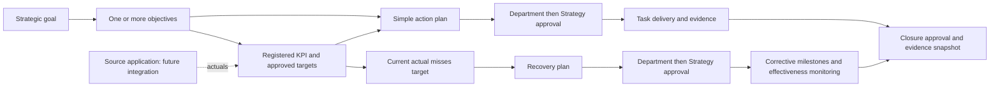
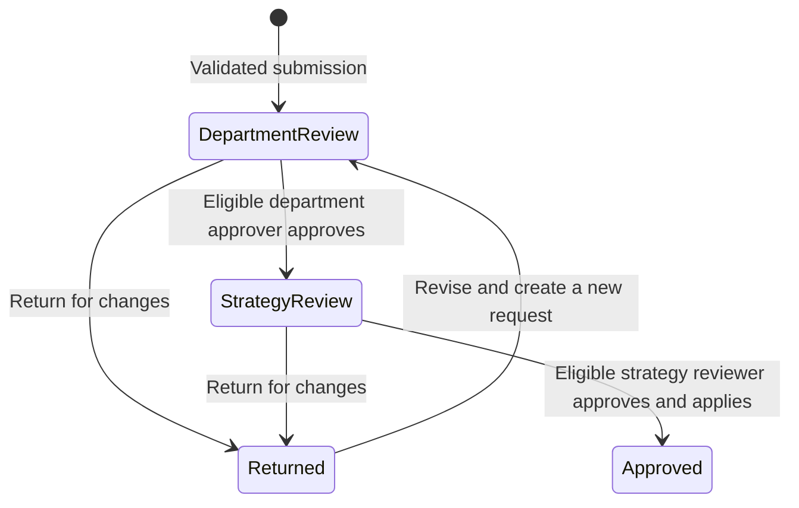
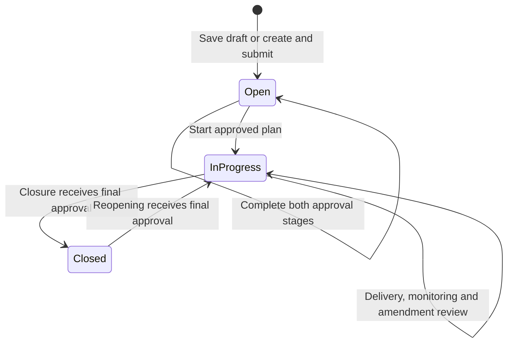

# Application workflows

**Reviewed: 17 September 2026.** This guide describes the current approval and delivery processes. Use the [user guide](USER_GUIDE.md) for screen-by-screen instructions and the [functional specification](FUNCTIONAL_SPECIFICATION.md) for detailed validation.

## Strategy to measurable outcomes

Strategy Team and Administrator maintain goals/objectives directly with audit history. Business writers register KPIs against objectives. Each KPI has one department and one objective; a strategic goal can contain many objectives. A direct objective action also has a responsible department. A KPI-linked plan inherits its department and strategic context.

Goal, objective, KPI and plan drawers link in both directions. Closing a plan never records an actual or increases a KPI score.

## Draft versus immediate submission

| Operation | On save/create | Submission and final effect |
| --- | --- | --- |
| Register KPI / revise draft | Unpublished draft; missing actuals | Submit separately; Department then Strategy publishes it |
| Published KPI amendment | Live definition remains unchanged | Proposal starts review; final approval applies permitted fields |
| Target setup | Approved thresholds remain unchanged | Proposal starts review; final approval changes current-period thresholds only |
| Create action plan | Open draft | Submit separately; final approval permits starting delivery |
| Create recovery plan — primary action | **Create & submit for approval** creates an Open plan and one request | Department review starts immediately; final approval permits starting recovery |
| Create recovery plan — Save draft | Open draft, no request | Complete initial detail and submit from Manage plan |
| Structural plan amendment | Approved plan remains unchanged | Department then Strategy applies proposed scope/details |
| Closure / reopening | Execution status remains unchanged while pending | Final approval revalidates and changes execution status |

Published KPI amendments cover name, owner, definition, formula, source metric key and objective. They do not replace source application, department, unit, direction or actual history. Historical targets are read-only.

## Two-stage approval

Department Approvers decide requests for their own department. Strategy Team decides the second stage across departments. Requesters cannot approve their own requests at either stage; an Administrator cannot bypass the policy. A different eligible reviewer is needed if a requester also holds an approval role.

Every decision needs a note. Each request retains before/proposed values, requester, department, base version, decisions and stage deadline. One pending request is allowed per entity. A stale request cannot be approved; return it for a fresh proposal. Final approval revalidates the change before applying it.

The configured review window sets the submission deadline and the new Strategy-stage deadline. Changing the window preserves existing stage deadlines. Overdue requests remain pending; they do not trigger automatic decisions or external messages. Missing approver coverage does not prevent submission but must be resolved through account configuration.

## Action delivery

An action can support an objective without a KPI, or any published KPI including a healthy one. Define the task, owner, deadline, priority and expected outcome; delivery notes and checklist items are optional. Save and submit the draft, then start it after both approvals.

Record progress and evidence while delivering the approved work. If a checklist exists, every item must have an owner, a deadline within the plan deadline, and completion evidence before closure. Request completion with delivery evidence against the expected outcome. No recovery review or Green-result gate applies.

## Recovery creation and management

Create recovery only for a current published Amber/Red KPI with an actual. Plans & recovery and the global Create menu offer an eligible-KPI chooser; current Impact/KPI details preselect the KPI. All entry points open the same form. Historical, healthy, missing-data and draft KPIs cannot initiate recovery.

The form captures a read-only trigger snapshot and prefills title, KPI owner, expected outcome, priority and deadline. Enter cause, corrective steps and next review, then choose **Create & submit for approval**. This validates before saving and creates exactly one Department-review request. Corrective steps initialize a milestone with the plan owner/deadline; success criteria, review owner and cadence are initialized.

**Save draft** retains unfinished corrective detail without submitting. Basic title, owner, outcome, valid deadline and eligible KPI are still required. Complete and submit later in Manage plan. Multiple recoveries per KPI are allowed; the chooser provides links to existing open work.

Pending review locks edits and execution. Final approval leaves the plan Open; **Start recovery** changes it to In progress. Manage plan then supports progress, milestone evidence and monitoring. Initial submission is not repeated after a plan was created with the primary submit action.

## Amendments versus routine updates

| Change | Governance |
| --- | --- |
| Title, owner, deadline, priority, expected outcome, corrective detail or milestone structure | Approved-plan amendment; current values remain active until both approvals |
| Progress notes | Local history/audit update |
| Completion and evidence within an assigned milestone/checklist | Routine update; recovery verification may need renewal |
| Monitoring assessment, evidence, blockers and next review | Routine review within an approved, complete In progress recovery |
| Close or reopen | Separate Department then Strategy request |

Pending requests block conflicting writes. Draft preparation is allowed before approval; execution and recovery monitoring require approval.

## Monitoring and closure gates

Recovery monitoring records one of **Monitoring**, **Blocked** or **Effective**, with evidence and a next review strictly after today. Blocked also requires blocker/intervention detail. Reviews capture the signed-in actor, plan revision and current observation/threshold window.

| Closure condition | Action plan | Recovery plan |
| --- | --- | --- |
| Approved, In progress, no pending request | Required | Required |
| Delivery/closure evidence | Required | Required |
| Completed, evidenced checklist/milestones | If a checklist was added | All mandatory milestones |
| Complete corrective detail | Not required | Required |
| Current Effective monitoring review | Not required | Required |
| Consecutive Green published-KPI results | Not required | Configured 2–6 periods; default 2 |
| Department then Strategy closure approval | Required | Required |

An Effective recovery review requires completed milestones and sustained Green results. It ceases to qualify when its next review becomes due or its revision/observation snapshot no longer matches the plan and results. Changes to relevant actuals, thresholds or recovery policy can require fresh verification.

Final closure checks the gates again and captures delivery evidence; recovery also captures corrective detail, reviews and period-by-period KPI evidence. Later changes do not rewrite that closure snapshot.

## Execution status and reopening

Open, In progress and Closed are execution states. Department review, Strategy review, Approved and Rejected describe request decisions; draft status describes work not yet approved. A pending closure stays In progress; a pending reopening stays Closed.

Reopening requires a reason and both approvals. It returns the plan to In progress, increments its revision and requires fresh recovery effectiveness before another recovery closure. The previous closure evidence remains available until a later closure supersedes it.

## Time and navigation

Analytical reporting periods appear only on overview, strategy, data flows, impact and reports. Operational workflows use the latest sample month, September 2026. Recovery creation deliberately switches to current results; deadlines and reviews use real calendar dates.

AI insights and top-bar search navigate authorized records and explain these workflows using local rules. Escalation classifications and notifications remain advisory/in-app; they do not dispatch external messages. [Integration requirements](INTEGRATIONS.md) describes the services needed for production.
