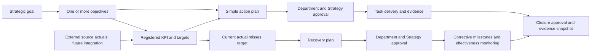
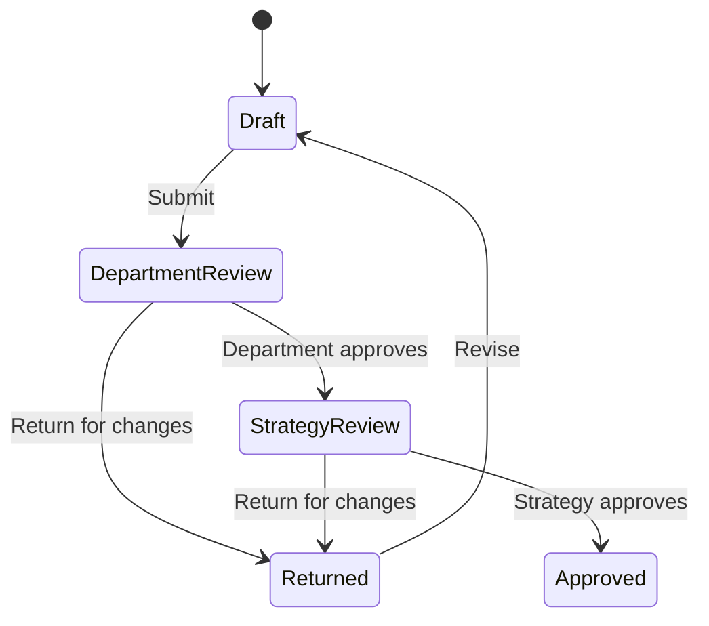

# Application workflows

## Objective to outcome

Strategy views link objectives to KPIs and plans. KPI details provide target setup and linked plans. Plan details show the path back to the KPI and objective. Contextual creation preselects the relevant KPI. Connected detail panels support Back navigation.

## Register KPI and set targets

1. Select **Register KPI** in the registry or shared Create menu.
2. Choose the objective and permitted department; enter the definition, owner, source, measurement direction, unit and targets.
3. Save and submit the draft for Department review, followed by Strategy review.
4. Final approval publishes the definition. Published target changes and definition amendments follow the same review sequence.

Actuals and baselines belong to source applications. There is no manual actual-entry form. Historical targets are read-only; current target proposals do not alter earlier periods or external observations.

## Roles and approvals

| Role | Scope and responsibility |
| --- | --- |
| Department Contributor | Assigned department; register KPIs, submit plans/changes and record approved-plan progress |
| Department Approver | Assigned department; first-stage business review |
| Strategy Team | All departments; strategic analysis and final business review |
| Administrator | All departments; app configuration and account assignments; no business-approval bypass |

Requesters cannot approve their own requests. Decisions require notes. A reviewer must have the appropriate role and department. A stale version cannot be approved; it must be returned and resubmitted. If the requester is the only department approver, an administrator must assign another eligible approver.

Approval applies to KPI publication/amendments, target changes, plan approval/amendments, closure and reopening. Routine delivery notes, evidenced milestone progress and monitoring operate within an approved plan and are audited. Stage deadlines use the configured review window; they do not automatically approve or reject work.

## Action plans and recovery

An **action plan** is a simple task linked directly to an objective or to a published KPI. Define the task, owner, responsible department, deadline and expected outcome. Delivery notes and checklist items are optional. Create it from the objective, KPI detail, plan board or shared Create menu.

A **recovery plan** starts only from a current At risk or Off track KPI with a source actual. Open that KPI and choose **Create recovery plan**. The form retains the actual-versus-target trigger and prefills the owner, target outcome and defaults. Add cause and corrective steps; a first milestone is initialized from the steps. The primary **Create & submit for approval** action validates the initial plan and immediately starts Department review, followed by Strategy review. The first milestone, success criteria and review defaults are initialized. **Save draft** is available for unfinished work. Prevention is optional. After both approvals, **Manage plan** supports delivery updates, evidence and monitoring; structural amendments require approval again. **Create recovery plan** on the board and global Create menu opens an eligible-KPI chooser, then the exact same recovery form used by Impact and KPI details. Existing open recoveries are linked from the chooser. The board also retains **Review KPI gaps** for analysis.

After approval, start delivery. Action plans use progress notes and completion evidence. Recovery plans use milestone evidence and monitoring outcomes. Structural changes require another approval request. Monitoring records capture the outcome, evidence, blockers, next review date and a snapshot of the relevant KPI results.

Closing an action plan requires delivery evidence against the expected outcome and completion/evidence for any optional checklist items. It does not require a monitoring review or Green KPI results. Closing a recovery plan requires completed evidenced milestones, a current Effective review and the configured number of consecutive Green periods for its published KPI (default two). Both require Department and Strategy closure approval. Final closure rechecks eligibility and stores the evidence snapshot.

For recovery plans, an overdue review or changes affecting the reviewed plan/results invalidate effectiveness verification. Reopening a closed plan requires a reason and approval. Closure and reopening do not edit KPI actuals.

## Reporting and navigation

Reporting-period controls appear on Executive overview, Strategy & objectives, Data flows, Impact & escalation, and Reports & analytics. Target setup, AI insights and plan workflows use current data. Administration and approval work do not need a reporting-period selector.

AI insights is a deterministic local navigation guide. It searches authorized goals, objectives, published/draft KPIs, action/recovery plans, sources, approvals and audit updates, and explains navigation; it is not a connected AI service. Notifications follow configured categories within the current account scope.
